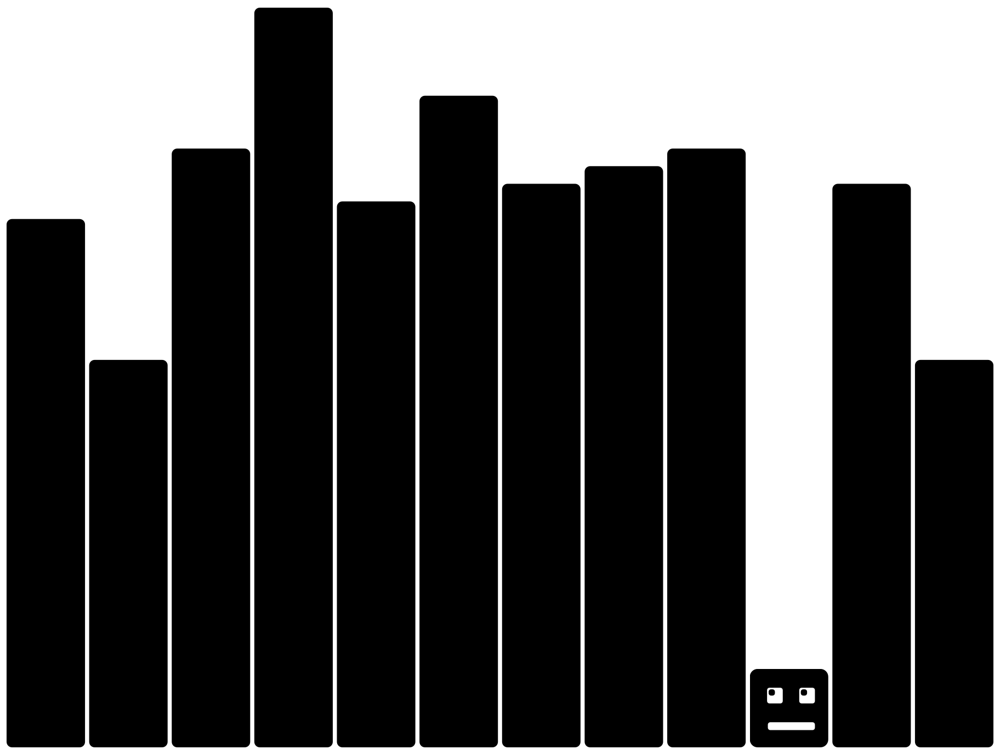

# Lost in data

This is a tiny excourse into data loaders, static svg routes in Framework and css keyframe animations embedded in SVGs.

Quick review how I got here. First I was (and as of writing this still am) frustrated with the walls of text on this page. It's not suitable for a DataVis bloggy project. But I didn't want to just throw some vis at the front page. Also most of the vis at that point is pretty dynamic or is created by larger amounts of data or is not static enough to give a good impression. 

So I wanted to discover the [embedding mechanics of Observable Framework](https://observablehq.com/framework/embeds). This way it's possible to generate static e.g. SVG assets from data projects I already have. Just simplify and I'm fine. But I notived I totally forgot a 404 page. So why not link the two interests?!

## A 404 vis

For the 404 page I had the idea of a little bar chart which traps a human looking bar inside. I build a small SVG in Figma this is _rectMoji_

${html`<svg width="100" height="100" viewBox="0 0 100 100" fill="none" xmlns="http://www.w3.org/2000/svg">
<rect id="head" width="100" height="100" rx="10" fill="black"/>
<rect x="23" y="68" width="60" height="10" rx="3" fill="white"/>
<rect x="22" y="24" width="20" height="20" rx="3" fill="white"/>
<rect class="rectmoji-eye" x="32" y="26" width="8" height="8" rx="3" fill="black"/>
<rect x="63" y="24" width="20" height="20" rx="3" fill="white"/>
<rect class="rectmoji-eye" x="73" y="26" width="8" height="8" rx="3" fill="black"/>
</svg>`}

The goal was not to be very artistic - because there is a lot to learn for me. Well the logics for the svg was pretty easy. Generate data, bin the data, randomly select a bin where we replace the bar with our newly created _rectMoji_, done! My next thought, right after "_nice it's working_" was "_that's boring_". The result was this:



Since this is an Observable Framework project I'm able to easily add interaction to visualisations, so I added an update button and played (way to long, it's too much fun) with the transitions and speeds.
You can see the prototype [here](https://observablehq.com/d/1cbe16f09b6f0edb).

Things I learned there:
- Initial animation matters (_rectMoji_ should drop at the correct x location, otherwise it's moving across the vis which looks horrible)
- On updating location it's better if _rectMoji_ first ducks down only the head edge is visible when the x location is changed, lastly update back to y
- The other bars can transition faster, so when the y position of our little friend is updated the bars are mostly in place

These are pacing/transition thoughts that really made fun to discover an led to the (as of now) final 404-Visual:

```js
const data = view(Inputs.button("Update", {value: getData(), reduce: () => getData()}));
```

```js
const [min, max] = [0, 200];
const settings = {
    count: 404,
    min,
    max,
    random: d3.randomInt,
    location: d3.randomInt
};
```

```js
const nbins = width >= 640 ? 12: 8;
```

```js
function getData() {
    const random_data = Float64Array.from(
        { length: settings.count },
        settings.random(settings.min, settings.max)
    );
    const bins = d3.bin().thresholds(d3.range(0, settings.max, settings.max / nbins))(random_data);
    const location = Float64Array.from(
        { length: 1 },
        settings.location(1, bins.length - 1)
    )[0];
    return { bins, location };
}
```

```js
// Build a simple emoji in figma, copy the svg code and paste it here
// Attributes for width and height are updated later
const emojiPath = `<svg width="100" height="100" viewBox="0 0 100 100" fill="none" xmlns="http://www.w3.org/2000/svg">
<rect id="head" width="100" height="100" rx="10" fill="black"/>
<rect x="23" y="68" width="60" height="10" rx="3" fill="white"/>
<rect x="22" y="24" width="20" height="20" rx="3" fill="white"/>
<rect class="eye" x="32" y="26" width="8" height="8" rx="3" fill="black"/>
<rect x="63" y="24" width="20" height="20" rx="3" fill="white"/>
<rect class="eye" x="73" y="26" width="8" height="8" rx="3" fill="black"/>
</svg>
`
```

```js
const emoji = new DOMParser()
    .parseFromString(emojiPath, "image/svg+xml").documentElement
```

```js
import {Chart} from "./lostindata.js"
```

```js
const chart = Chart(emoji, emojiPath);
```

```js
const aspectString = width >= 640 ? "4/3" : "4/5";
const styleString = `aspect-ratio: ${aspectString}; min-height: 400px`;

display(html`<div class="card" style=${styleString}>
  ${resize((width) => chart.render(width, data, aspectString))}
</div>`);
```

If you play a little with it you notice that the eyes are moving, depending on the largest bar near it. The aspect ratio is linked to the containers width and can rebuild the data. On small screens the ratio drops from `4/3` to `4/5` and the number of bins is reduced from `12` to `8`. One thing to fix is the full rerender on width change. I think a different [`ResizeObserver`](https://developer.mozilla.org/en-US/docs/Web/API/ResizeObserver) could fix this easily. For the full code see the [lostindata.js]() page.

## Data loaders

The initial goal was to get some static things to show on the sites introduction. Welcoming people with a wall of text is not what I intended. So since this little playful 404 vis gives me so much joy I'd like to use it to explore Observable Frameworks data loader capacities a bit more. 

My idea is pretty straight forward:
- Build a data loader for a an SVG file like `<vis-name>.svg`
- The loader for this file would be named `<vis-name>.svg.js` (one can use others too but here `.js` is fine)
- This loader will be called during the build process
  - But only when this file is required, meaning the build process detects the SVG file is missing
  - To hint the build process to create the file (if one didn't use `FileAttachment` somewhere) is `dynamicPaths` in the `observable.config.js`
  - Every path in this `dynamicPaths`-array is included in the build output
  - You'll need to add the SVG file name `<vis-name>.svg` not the data loader with prefix `.js` to hint the loader execution
- Create a folder structure for data loaders that are available to the public, which makes the routes available in the deployment

Good we already got the code to create a data loader so I removed the interactive parts and after a while of confusion:

> **Important learning 💡**: files in `dynamicPaths` seem to be available only when the project is build not in dev mode.

it is possible to link it all together. The `lostindata.svg` is created through `lostindata.svg.js` which is available at `/embeds/lostindata.svg` 
can be called here in plain markdown:

```md echo

```

This way we now don't need `dynamicPaths` anymore, but I'll keep it, because I don't want to use the svgs everytime I create a new one.
This is what it looks like:


## Add animation

It's a static SVG. The eyes and bars are moving (I'm not experienced with keyframe animations ... yet), but at least in principal it has moving parts. This is something one can do while the SVG is build in the data loader. By including a `style` tag, the browser is able to play a simple animation from inside the SVG. This I learned is called embedded CSS. That's exactly the same trick I learned from the [Visualising Climate logo replica](/learning_from_pros/visualising_climate), all you need is this to add a style tag to the svg:

```js echo run=false
svg
    .append("style")
    .text(`
        @keyframes look-around {
        0%, 100% { transform: translateX(0); }
        25%      { transform: translateX(-8px); }
        75%      { transform: translateX(0); }
        }

        .rectmoji-eye {
        animation: look-around 3s ease-in-out infinite;
        }
        @media (prefers-reduced-motion: reduce) {
            .rectmoji-eye { animation: none; }
        }`
    )
```

