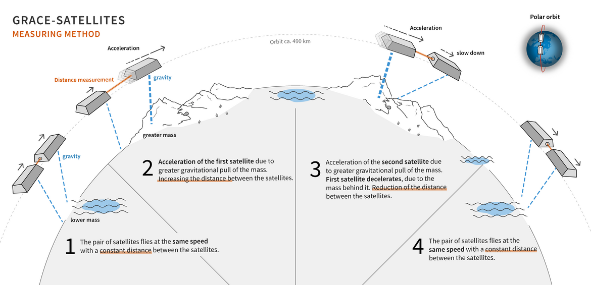

# Holding a toe into spatial/satellite data

## Coverage
- How do I come to write about hydro-geo data from satellite?
- Basics of the satellite data repository outputs (I'm not into physics)
- Journalistic importance using the actual data at hand
	- Good usage found at Spiegel.com for their work on deforestation
- Query Copernicus Data Store (CDS) and earthdata.nasa
- Visualising some examples
	- Groundwater
	- Precipitation
	- Evapotranspiration
	- Storage Delta
- Exploring physics and it's limitations
- Pros know better I just saw a glimps of what's going on there


## How do I come to write about satellite and geo data?
I'm working as a freelance data scientist/engineer for around 10 years now. I had different projects and customers, but in 2025 I met two Hydrogeologists that mostly work in Brazil and Germany. They had a project for me, that I won't talk about - I signed an NDA. No chance to talk about it. But during the time I started getting interested in this type of science. It's so deeply (no pun intended) grounded in environmental exploration and explanation, that I started to look into this a bit for myself. 

So the following lines are a small excursion into what I learned on this little trip. First of all hydrogeologists are underground-water-detectives. Their job is so tedious from what I saw, that it really impressed me. To find out about groundwater the need to use various programs (sadly excel is one of them), and layer data on top for multiple iterations. To me it felt like a gardener having to find the next well, that hopefully didn't dry to even think about watering their plants.

Anyway these people nowadays use a ton of satellite data for their work. That made me interested - they coped with an ESA project and got themselves into satellites, their sensors and characteristics. This is important, a satellite alone will measure something, that's as always a number describing a certain aspect - mostly some physics. It's not _the truth_, whatever that may be. A satellite won't tell you the vegetation is health here, it tells: the degree of green has changed in this direction, since the last measurement. I learned interpretation is extremely important with this sort of data or analysis based on it.


## Basics of the satellite data repository outputs
As you may know there are very many satellites circling all around the earth at the moment, monitoring an extreme amount of signal, so we can explain the conditions on earth. Or they only support paying customers with internet. Nothing wrong with it, but it seams to be extremely crowded up there. Just take a look [Starlink satellites according to satellitetrackerlive.com](https://www.satellitetrackerlive.com/satellites/starlink). Starlink alone has 11k satellites in the orbit. I wonder if they have to pay for the space they use up there. Anyways this is another topic. Luckily there is are also measurement tools circling the earth to monitor various things like climate or environmental variables provided through physics for example there is a satellite mission called GRACE that measures the gravity changes and it can inference terrestrial and groundwater state change across the planet. 



Image via [GRACE Missions via GFZ, the Helmholtz Centre fro Geoscience](https://www.gfz.de/en/spotlights/grace)


## Journalistic importance
I dig through the DDJ portfolios from time to time, this genre is very near my interest zone and daily work at the same time, so I'd like to devote a few words on how relevant it is to use the publicly available data at hand. Data driven journalism is the exact spot where this data can help communicating climate change and the effects that come with it. 

The urgency is known to all of us although some ignore it, but the implications and how science is concluding it's recommendations are hard to communicate sometimes. This is what science journalism is for. But that's also the point where DDJ can help a lot. Data-Journalists usually know from their daily work how to simplify things so a wider audience can really understand it and also get a better feeling for the actual implications in their daily lives. A few good examples cover war damage, climate, deforestation, illegal settlements or mining operations
- [Spiegel.de 2025/11](https://www.spiegel.de/wissenschaft/natur/cop30-im-amazonas-regenwald-was-passiert-wenn-er-kollabiert-a-b3cbb92d-b7e7-4cf7-a469-dfad7bb3f239)
- [Correctiv.org 2024/10](https://correctiv.org/aktuelles/2024/10/01/zwischen-asphalt-und-beton-versiegelung-deutscher-staedte-nimmt-zu/)
- [Tagesspiegel 2024/2](https://interaktiv.tagesspiegel.de/lab/satelliten-karten-der-zerbombten-staedte-das-unvorstellbare-ausmass-von-zwei-jahren-ukraine-invasion/)
- [Berliner Morgenpost 2016/5](https://interaktiv.morgenpost.de/gruenste-staedte-deutschlands/)

There are many more, used as context in general articles, not only DDJ pieces. According to DDJs I talked to this is the daily work, providing context for articles that are published through out the news cycle. It's not as often the big analysis with a lot of attention, that shows the overall context and let's you zoom into the details in a fancy storytelling framework - more a "somebody needs a graphic for context". 
But when they get to it and need to use satellite imagery one very popular approach was to use vegetation analysis.


## Example: Vegetation in urban space
For sure the most common used is an urban vegetation index. Doing that from satellite images we'd need to know what these satellites do. The ones used for this analysis are the missions Sentinel 1 and 2, coming from the Copernicus Program by the European Space Agency (ESA). These satellites use radars to scan across the earths surface. This data is usually post-processed and provided in a data store like [NASA's earthdata protal](https://search.earthdata.nasa.gov) or [Copernicus Data Space](https://browser.dataspace.copernicus.eu/). In case of Sentinel 1/2 the satellites carry radar instruments with different characteristics like frequency or wavelength. So when you dig down the Bands are different instruments to measure for different objectives. For Sentinel 1 the mission carries a Synthetic Aperture Radar (SAR), which sends microwaves in pulses and measures the bounce back. That's super nice this way it works through clouds and at day or night. There is a lot more detail involved where I will stumble quickly. But Sentinel 2 for example carries a sensor that takes pictures in red band, near infrared band and mutliple shortwave-infrared bands. 

Now the way you get this [Normalized Difference Vegetation Index]()(NDVI) you take (NIR − Red) / (NIR + Red), where NIR is the near infrared band. Healthy plants reflect near-infrared strongly with less of the red band. This way the NDVI grows for vegetation and shrinks for bare/built surfaces. The only problem with that is dry brown soil surface in this definition looks like sealed surface. That's why people use Sentinel 1 as a counter part to NDVI alone. The microwaves measure bounce back so it get's a different response from asphalt then it gets from dry/brown soil surface. This way the two are distinguishable. 

**!! Add a short example here !!**

The results bundled with more other data sources are also available in a ESA dataset called WorldCover. Where you get classes in like buildup, tree, vegetation, shrubland distinguished from grasslands to permanent water bodies or snow and ice. There are many more applications for using NDVI alone. Analysis in agriculture can estimate or monitor crop or vegetation health. In environmental studies people stop deforestation or use it as an indicator for drought detection.


## Query Copernicus Data Store (CDS) and earthdata.nasa
Before we get into this, these data stores are not really like yet another API but for geo data. It's different. The volumes can grow extremely fast. If you have an average computer you can easily fill you disk space with a few hundred GB. Don't worry it's not going to go fast. For example when you query environmental data from the [Copernicus Data Store](https://cds.climate.copernicus.eu/datasets) you will be faced with many limits. You should first start small and then go forward from there. The limits are brutal, because they are global - for every single user and this will throttle your queries fast. So you have another layer to think about: when do I submit a query to the queue. 


### A practical climate data example
Say you are interested in downloading basic climate data from the Copernicus project, you'd create an account at [ECMWF.int](https://www.ecmwf.int/) (this is the European Centre for Middle and near Weather Forecasts - _welcome to accronym hell_) and go to the [Climate Date Store](https://cds.climate.copernicus.eu). There you'll find dozens of datasets of different kind. Some are post-processed (ready for analysis), some are temporally varying hours, daily, monthly and already aggregated which is the most common processing. For climate data ECMWF has compiled different datasets, where one of the most common is ERA5. 

Say we want to visualise european temeratures of Jan to July of the last 10 years, into the current year for 2026. As of writing this July 2026 is not finished, so it's not included in the reanalysis data of ERA5, coming from the Copernicus Data Store. You can either create a one time static query on the website ([cds.climate.copernicus.eu](https://cds.climate.copernicus.eu/)) or you do it in a small python script that could look like so:

```python
import cdsapi

dataset = "reanalysis-era5-single-levels-monthly-means"
request = {
    "product_type": ["monthly_averaged_reanalysis"],
    "variable": [
        "2m_temperature",
        "total_precipitation",
        "lake_depth",
        "land_sea_mask"
    ],
    "year": [
        "2016", "2017", "2018",
        "2019", "2020", "2021",
        "2022", "2023", "2024",
        "2025", "2026"
    ],
    "month": [
        "01", "02", "03",
        "04", "05", "06",
        "07", "08", "09",
        "10", "11", "12"
    ],
    "time": ["00:00"],
    "data_format": "netcdf",
    "download_format": "zip",
    "area": [71, -14, 27, 49.5]
}

client = cdsapi.Client()
client.retrieve(dataset, request).download()
```

When you are getting started, I'd highly recommend clicking through the web interface can copy the code from your request as you build it. You can then make certain fields dynamic or tweak it as you get the first results. 

This will download the data from the Climate Data Store and provides it in a NetCDF file. These files are essentially datasets made from Arrays, where some arrays and their values are used to spatially or temporally slice the files information, so you can analyse quickly. Libraries also have support for advanced transformation or reduction functions. All very handy.
For more details on how to post process query results with Python, see [Dataworks](https://github.com/arrrrrmin/arrrrrmin.dev/tree/main/dataworks/). It can be tricky at times especially when you need to serve large amounts of data, which you can get to quite quickly. For example the query above looks for 12 months over 10+ years and 3 variables over ${meta.lons.length} longitudes and ${meta.lats.length} latitudes. That makes ${10 * 12 + 3 * meta.lons.length * meta.lats.length} values for a very simple dataset (the `UINT8` quantised numpy binaries that I load in this frontend are each 4.5MB). So be aware, these datasets grow fast.

```js
const cubes = {
	t2m: FileAttachment("../data/cds_era5_monthly_eu/cube_t2m.u8"),
	tp:  FileAttachment("../data/cds_era5_monthly_eu/cube_tp.u8"),
};
const meta = await FileAttachment("../data/cds_era5_monthly_eu/cube.json").json();
```

```js
const variable = view(Inputs.select(Object.keys(cubes), {value: "t2m", label: "variable"}));
```

```js
const info = meta.variables[variable];
const q = new Uint8Array(await cubes[variable].arrayBuffer());
const n = meta.lons.length * meta.lats.length;
const bounds = {
	"lon0": d3.min(meta.lons), 
	"lon1": d3.max(meta.lons),
	"lat0": d3.min(meta.lats), 
	"lat1": d3.max(meta.lats)
}
```

```js
const t = view(Inputs.range([0, meta.times.length - 1], {step: 1, label: "month"}));
```

```js
const frame = Float32Array.from(
  q.subarray(t * n, (t + 1) * n),
  // Dequantise
  v => v === info.sentinel ? NaN : info.vmin + v * info.scale
);
const caption = "Data provided by the Copernicus earth observation programm, through the ERA5 dataset distributed by the European Centre for Medium-Range Weather Forecasts (ECMWF)";
```

```js
function getMap(width) {
	const scheme = variable === "t2m" ? "BuYlRd" : "RdYlBu";
	const domain = {type: "MultiPoint", coordinates: [[bounds.lon0, bounds.lat0], [bounds.lon1, bounds.lat1]]};
	return Plot.plot({
		title: `ERA5 variable ${info.long_name} at ${meta.times[t]}`,
		subtitle: "Chart is roughly european centered through the bounding box area restirction in the query in the above.",
		caption,
		width,
  		projection: {type: "equirectangular", domain, inset: 0},
		x: {ticks: null},
		y: {ticks: null},
		color: {
			legend: true, scheme: scheme, type: "linear",
			domain: [info.vmin, info.vmax],
			label: `${info.long_name}${info.units ? ` (${info.units})` : ""}`,
		},
		marks: [
			Plot.raster(frame, {
				width: meta.lons.length, 
				height: meta.lats.length,
				x1: bounds.lon0,
				x2: bounds.lon1,
				y1: bounds.lat1,
				y2: bounds.lat0,
			}),
		],
	})
}
```
<div>
<div class="card" style="min-height: 400px">
${resize((width) => getMap(width))}
</div>
</div>

In the above visualisation I simply write the cubes of shape (time, lons, lats) to a raster layer with an equirectangular projection. This is also why it's not looking as nice an image with ${meta.lons.length} longitudes along the width of ~${width}px - margin is not the idea scenario. At least for desktop screens the width number is stretching the image pretty much.

Anyways as soon as you have these NetCDF files you can do spatial or temporal reduction on them very handily. It's the main reason people in this geo-* fields work with these types of files. But for web things you may want to turn to ZARR stores for a web optimized alternative. In the following example I prepared the spatial reduction of the whole landmasked area you see above and computed min, max, mean and median for each variable and each month:

```js
const monthly = await FileAttachment("../data/cds_era5_monthly_eu/monthly.json").json();
const monthly_data = monthly[variable].map(d => ({...d, time: new Date(`${d.time}-01`)}));
const yname = variable === "tp" ? "sum" : "mean";
```

```js
function getLine(width) {
	const scheme = variable === "t2m" ? "BuYlRd" : "RdYlBu";
	return Plot.plot({
		title: `${info.long_name} averages over time`,
		caption,
		width,
		y: {label: info["units"]},
		color: {
			legend: true, scheme: scheme, type: "linear",
			domain: d3.extent(monthly_data, d => d[yname]),
			label: `${info.long_name}${info.units ? ` (${info.units})` : ""}`,
		},
		marks: [
			Plot.rectY(monthly_data, {x: "time", y: yname, fill: yname, interval: "month"}),
			// Plot.line(monthly_data, {x: "time", y: yname}),
			// Plot.dot(monthly_data, {x: "time", y: yname, r: 3, fill: yname}),
			Plot.ruleX([new Date(`${meta.times[t]}-01`)], {stroke: "gray", strokeWidth: 2}),
			Plot.text([{time: new Date(`${meta.times[t]}-01`), text: "Selected"}], {x: "time", fill: "gray", text: "time", textAnchor: "start"}),
		]
	})
}
```

<div class="card" style="min-height: 200px;">
${resize((width) => getLine(width))}
</div>

This is the same chart but with a different comparison aspect, this time the chart splits per year. 
This way it's easier to compare the yearly cycle, but be aware that this is the average over a huge area, but still apart from some outliers the darker lines are more recent and live higher up the temperature curve.
For precipitation it looks different, precipitation is dependent on meteorological variables which I won't get into as well. There is a subtile change to the two variables, while precipitation is event driven and you may have a whole week or two without rain at all, temperature is not as event driven. The suns state at a certain time stands high or not and doesn't change from one day to another. This is why precipitation is mostly reportated as a cumulative quantity and temperature as an averaged state. In short it's either a flux or a state variable. Most climate/meteoro scientists most likely will have tons of additions to add to this simplified summary.

```js
function getYearlyComparison(width) {
	const years = monthly_data.map((d) => ({...d, month: d.time.getMonth() + 1, year: d.time.getFullYear()}));
	return Plot.plot({
		title: `${info.long_name} averages split per year`,
		subtitle: `Each year is one line while the x axis shows the months, y shows the averaged ${info.long_name.toLowerCase()} over the whole area. Please note that this is an average over local climate zones, that vary strongly over wide areas`,
		caption,
		width: width,
		color: {
			scheme: "reds",
			legend: true,
			label: "Years",
		},
		x: {label: "Month", grid: true, ticks: Array.from({ length: 12 }, (_, i) => i + 1)},
		y: {label: `${info.long_name} (${yname} in ${info.units})`, grid: true, nice: true},
		marks: [
			Plot.line(years, {x: "month", y: yname, z: "year", stroke: "year", curve: "catmull-rom"}),
			Plot.dot(years, Plot.pointer({x: "month", y: yname, z: "year", fill: "black", r: 6})),
			Plot.text(years, Plot.pointerX({px: "month", py: yname, dy: -17, frameAnchor: "top-right", fontVariant: "tabular-nums", text: (d) => [`Date ${Plot.formatIsoDate(d.time)} | Mean ${d[yname].toFixed(4)} ${info.units}`]}))
		],
	});
}
```

<div class="card" style="min-height: 200px;">
${resize((width) => getYearlyComparison(width))}
</div>

This ERA5 dataset is by the way also the foundation of the Visualizing Climate Conference Logo, which I recreated in [this little article](../learning_from_pros/visualising_climate).  

