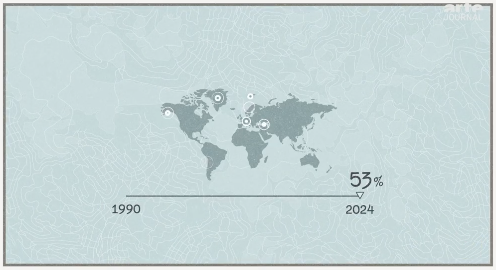

# ARTEs piece on glacial lake floods

On 2026/08/28 ARTE published a info piece to show how the recent nepal flood was caused and how this problem is yet another one linked to global climate change. I liked the piece visually and downloaded it using [`yt-dlp`](https://github.com/yt-dlp/yt-dlp).
The animated piece explained how glacial lakes outburst and create horrible floods like the one that hit Nepal this week.
It didn't take long and now I'm also interested in what data they may used. 

## Nepal floods

ARTE published their piece, since the [current situation in Nepal](https://www.dw.com/en/nepal-flood-death-toll-crosses-900-thousands-still-missing/a-78568505) (as of 2026/08/31) is horrible and the phenomena of glacial outburst floods is publically not well known. The info piece describes how a [Glacial lake outburst flood (GLOF for short)](https://en.wikipedia.org/wiki/Glacial_lake_outburst_flood) is caused and what aligned it with the climate change situation the world is in. Breaking news, everything happening in nature is likely to large extends fueled by climate change - but it's important to cover it extensivly. 

## Glacial lake outburst floods

GLOFs as the name says are caused by some sort of outburst that suddenly releases meltwater that once filled a hollow in the hills and created a lake. These lakes are created by retreating ice formations thousands of years ago (around [10000 years](https://en.wikipedia.org/wiki/Glacial_lake)). The ice left back in melted and the hollow formation filled with meltwater and forms a lake. The outburst flood part of the phenomena is influenced either by a breaking dam part in the crust or melting ice that exeeds the capacity of hollows. There is a special case where geotermic peaks cause ice to melt and peak the lakes water level far above the threshold. These cases are scientifically known as [Jökulhlaup](https://en.wikipedia.org/wiki/Jökulhlaup), an term originally from iceland where the science regarding these geological phenomena is a well researched subject as they are more endangered than most regions of the world. By definition GLOFs are catastrophic events with high impact but low frequency, meaning although they don't happen very often the large amounts of water that are released have a high thread potential compared to the well-known floods in rain season for example.

## Historic data

The first interesting thing was this line chart which shows the number of glacial lakes globally:



The voice on the audio guiding this graphic, explains that the number of glacial rivers has grown about 53% from
1990 to 2024. At first I was surprised that this number actually exists in a global fashion and I was somehow delighted that there is a public dataset that tracks the number of glacial lakes since 1990.
The dataset I found is "[_High Mountain Asia Near-Global Multi-Decadal Glacial Lake Inventory V001_](https://search.earthdata.nasa.gov/search/granules?p=C3249539102-NSIDC_CPRD&pg[0][v]=f&pg[0][gsk]=-start_date)". Because the name  suggests only Asian Mountains coverage I almost overlooked it. Recently I do more environmental data exploration in my daily work so at some point one gets used to strange naming conventions in scientific datasets - and terrible achronym usage. The dataset is a collection of shape files that globally span 1990 to 2018 in epochs of 10 or 5 years and it didn't recievce an update since the last epoch 2015-2018.

Here is how the data looks like:

```js
const hma_stats = await FileAttachment("data/glofs/HMA_statistics.json").json()
    .then(d => d.map(D => ({...D, start: new Date(`${D.start}-01-01`), end: new Date(`${D.end}-12-31`)})))
    .then(d => d.sort((a, b) => a["start"] - b["start"]));
const lakes_start = hma_stats[0]["lakes"];
const lakes_end = hma_stats[hma_stats.length - 1]["lakes"];
const total_area_start = hma_stats[0]["total_area"];
const total_area_end = hma_stats[hma_stats.length - 1]["total_area"];
const increase_num_lakes = ((lakes_end - lakes_start) / lakes_start).toFixed(2) * 100;
const increase_total_area = ((total_area_end - total_area_start) / total_area_start).toFixed(2) * 100;
const hma_increase = {
    start: new Date("1990-01-01"),
    end: new Date("2018-12-31"),
    today: new Date(),
    lakes_start,
    lakes_end,
    increase_num_lakes,
    increase_num_lakes_label: `${increase_num_lakes}% increase\ncompared to\n1990-2000`,
    total_area_start,
    total_area_end,
    increase_total_area,
};
```

```js
function getHistoricIncreaseChart(width) {
    return Plot.plot({
        title: "Historic increase of glacial lakes world wide",
        subtitle: "Data provided by the High Mountain Asia Near-Global Multi-Decadal Glacial Lake Inventory via the National Snow and Ice Data Centre at the University of Colorado",
        width,
        x: {domain: [hma_increase.start, hma_increase.today], grid: true, label: "Time"},
        y: {domain: [hma_increase.lakes_start - 1000, hma_increase.lakes_end], label: "Glacial lakes", tickFormat: "s"},
        marks: [
            Plot.arrow(hma_stats, {
                x1: "start",
                y1: "lakes",
                x2: "end",
                y2: "lakes",
                stroke: "currentColor",
                strokeWidth: 1.5,
            }),
            Plot.link([hma_increase], {
                x1: "end",
                y1: "lakes_end",
                x2: "today",
                y2: "lakes_end",
                stroke: "currentColor",
                strokeWidth: 1.5,
                strokeDasharray: [2, 4],
            }),
            Plot.link([hma_increase], {x1: "today", x2: "today", y1: "lakes_start", y2: "lakes_end", strokeWidth: 1.5, marker: "tick"}),
            Plot.text([hma_increase], {x: "today", y: d => d.lakes_start + (d.lakes_end - d.lakes_start) / 2, strokeWidth: 1.5, text: "increase_num_lakes_label", textAnchor: "end", dx: -4})

        ]
    })
}
```

<div class="card">
${resize((width) => getHistoricIncreaseChart(width))}

</div>

First finding the graphics makers at ARTE simply took the ${increase_num_lakes}% and carried it forward to 2024. I really don't know why 2024 but using the High Mountain Asia dataset I get the same number. Btw this dataset also carries the area in m<sup>2</sup> where the difference is marginal with an increase of ${increase_total_area}%. 

### Design decision

Now that I looked at the data I can totally see why the makers reduced the chart to a single line. As you can see above, my version is not intuative. The epoch lengths vary which made me use arrows to give a better sense for the time axis but at the same time it's more confusing than anything else. Here I notice the __difference between visualising and communicating data__. Now that I tried a different version, I like ARTEs simplified approach much more.

## Does the flood frequency increase?

While I was looking for data on glofs in general I stumbled over a database published by the [University of Potsdam](https://glofs.geoecology.uni-potsdam.de). Please be aware that the link doesn't support SSL/TLS so it's _insecture_.
The database is a larger .ods file (LibreOffice equivalent to Excel) and contains a collection of scientifically documented or researched GLOF events.


```sql id=[...glofs_per_year]
SELECT
  cast(year as INTEGER) as year_,
  COUNT(*) AS value
FROM 'glofsdb'
WHERE year_ >= 1850 AND year_ <= 2025
GROUP BY year_
ORDER BY year_
```

```js
const glofs_data = {
    title: "Glacial lake outburst floods 1850 - 2026",
    subtitle: "Flood data of the last 35 years provided by the University of Potsdam (glofs.geoecology.uni-potsdam.de)",
    valueLabel: "Number of floods",
    data: glofs_per_year.map(d => ({...d, year: d.year_}))
}
```

```js
const global_warming = await FileAttachment("./data/glofs/climate-global-warming.csv").csv().then(d => ({
    title: "Global temperature anomaly 1850 - 2026",
    subtitle: "Temperature corresponds to near surface temperature (2m), anomalies are compared to the 1861-1890 mean, climate data provided by OurWorldInData.org",
    valueLabel: "Temperature anomaly (°C)",
    data: d.map(
        D => ({...D, year: parseFloat(D.year), value: parseFloat(D.near_surface_temperature_anomaly)})
    ),
}));
```


```js
function getOutburstsOrTemperatureChart(width) {
    const selectedData = dataSelection === "Glacial Floods" ? glofs_data : global_warming;
    const title = selectedData.title;
    const subtitle = selectedData.subtitle;

    return Plot.plot({
        title,
        subtitle,
        width,
        y: {label: selectedData.valueLabel, grid: true},
        x: {ticks: 20, label: "Year", tickFormat: "d", ticks: 12.5},
        color: {
            scheme: "Blues",
            reverse: false,
        },
        marks: [
            Plot.ruleX(selectedData.data, {x: "year", y: "value"}),
            Plot.dot(selectedData.data, {x: "year", y: "value", r: 3, fill: "currentColor"}),
        ]
    })
}
```

```js
const dataSelection = view(Inputs.select(["Temperature Anomaly", "Glacial Floods"], {value: "Floods", label: "Data selection"}));
```


<div class="card" id="glofs-and-temperature">
${resize((width) => getOutburstsOrTemperatureChart(width))}

</div>

This dataset tells the same story but with actual events, which in my opinion is more urgent, since it covers actual events. Also it covers older floods too - but I guess this might open up discussions for a monitoring bias. But regardless of the what critiques might bring up, data clearly shows that this is strongly correlated with rising temperatures.

## Who is endangered by glacial floods

The other very interesting animated graphic in this ARTE report is a section where they cited a nature article with the title [Glacial lake outburst floods threaten millions globally](https://www.nature.com/articles/s41467-023-36033-x). The abstract is literally number and highlighted countries:

> Here we show that 15 million people globally are exposed to impacts from potential GLOFs. 
> ... More than half of the globally exposed population are found in just four countries: India, Pakistan, Peru, and China. 


Don't get me wrong this is totally fine, I'm just surprised how _easy_ it sometimes is to do valuable data vis or infographics when you simply cite the numbers, that are already calculated by established research. That's a really good thing, in the end journalists have the most stressfull job that follows a fast news cycle. If they'd need to calculate the numbers again to verify, that is (1) not their job and (2) not practiable in time.
Anyways I'm glad ARTE cites established research (it's not that hard in the end). 

Regardless of where they got the numbers from, I took the High Mountain Asia dataset and visualized it in two ways: (1) detailed to see every glacial lake and (2) an aggregated version grouped to country level and located at the countries center point. Additionally I adapted the country highlighting as stated by the nature article. In the detailed map you mostly see all the edges around greenland and adjacent arctics with a lot of ice an glacial lakes. Alaska and the South American Andes also have a lot of glacial lakes, but it's in general way to cluttered. 

```js
const HIGHLIGHT_COUNTRIES = ["India", "Pakistan", "Peru", "China"];
const lmap = await FileAttachment("../data/geo/land-110m.json").json();
const cmap = await FileAttachment("../data/geo/countries-110m.json").json();
let highPopCmap = structuredClone(cmap);

const country_geom = highPopCmap.objects.countries.geometries;
highPopCmap["objects"]["countries"]["geometries"] = highPopCmap["objects"]["countries"]["geometries"].filter(
    c => HIGHLIGHT_COUNTRIES.includes(c.properties.name)
)

let land = topojson.merge(lmap, lmap.objects.land.geometries);
let highPopCountries = topojson.feature(highPopCmap, highPopCmap.objects.countries);
const countries = topojson.feature(cmap, cmap.objects.countries);
```

```js
const hma_locations = await FileAttachment("data/glofs/HMA_locations.json").json()
    .then(d => d.map(D => ({...D, start: new Date(`${D.start}-01-01`), end: new Date(`${D.end}-12-31`)})))
    .then(d => d.sort((a, b) => a["start"] - b["start"]));
const glacial_lake_locations = hma_locations[hma_locations.length - 1].children;
const glacialLakesPerCountry = cmap.objects.countries.geometries.map(
    (country) => {
        const countryLakes = glacial_lake_locations.filter(loc => country.properties.name.startsWith(loc.Country));
        const countryFeature = countries.features.filter(c => c.properties.name === country.properties.name)[0];
        const countryArea = d3.geoArea(countryFeature) * (6371008.8 ** 2) / 1e6;
        const lakeTotalArea = d3.sum(countryLakes, d => d["Area_km2"]);
        const lakeFractionalArea = lakeTotalArea / countryArea;
        return {
            name: country.properties.name,
            numLakes: countryLakes.length,
            lakeTotalArea,
            countryArea,
            lakeFractionalArea,
            coordinates: d3.geoCentroid(countryFeature),
        }
    }).filter(d => d.numLakes > 0).sort((a, b) => b.numLakes - a.numLakes);
```


```js
const detailedLakesMap = view(Inputs.toggle({label: "Detailed map", value: false}))
```

```js
const dotOptions = { fill: "white", fillOpacity: 0.01, stroke: "white" }

function getLakeLocationsMap(width, detailed){
    let conditionals = {
        detailed: {
            title: "Detailed glacial lake locations",
            subtitle: "The map is based on the latest research using High Mountain Asia data, last updated 2018. Circles symbolize the area size per lake. Data provided by NASA, obtained by National Snow and Ice Data Center (Colorado).",
            r: {range: [2, 10]},
            marks: [
                Plot.dot(glacial_lake_locations, {
                    x: "Longitude",
                    y: "Latitude",
                    r: "Area_km2", 
                    ...dotOptions
                }),
            ],
            dotLabel: "Glacial lake",
        },
        perCountry: {
            title: "Glacial lakes per country world wide",
            subtitle: "The map is based on the latest research using High Mountain Asia data, last updated 2018. Circles symbolize the number of glacial lakes per country. Data provided by NASA, obtained by National Snow and Ice Data Center (Colorado).",
            r: {range: [2, 24]},
            marks: [
                Plot.dot(glacialLakesPerCountry, {
                    x: d => d.coordinates[0],
                    y: d => d.coordinates[1],
                    r: "numLakes",
                    stroke: "white",
                    strokeWidth: 2,
                }),
                Plot.dot(glacialLakesPerCountry, {
                    x: d => d.coordinates[0],
                    y: d => d.coordinates[1],
                    r: 2,
                    fill: "white",
                }),
                Plot.tip(glacialLakesPerCountry, Plot.pointer({
                    x: d => d.coordinates[0],
                    y: d => d.coordinates[1],
                    //filter: (d) => d.info,
                    title: (d) => `${d.name}\nGlacial lakes: ${parseInt(d.numLakes)}\nTotal lake area: ${d.lakeTotalArea.toFixed(2)} km2`,
                })),
            ],
            dotLabel: "Glacial lakes per country",
        }
    }
    const plugins = detailed ? conditionals["detailed"] : conditionals["perCountry"];
    return Plot.plot({
        title: plugins.title,
        subtitle: plugins.subtitle,
        width,
        projection: "equirectangular",
        r: plugins.r,
        marks: [
            Plot.sphere({fill: "#c7e2e0", fillOpacity: 0.4}),
            Plot.geo(land, {fill: "#86a3a6", fillOpacity: 0.6}),
            Plot.geo(countries, {fill: null, stroke: "#86a3a6"}),
            Plot.geo(highPopCountries, {fill: "#D17455", strokeOpacity: 0.6, stroke: "#c7e2e0"}),
            ...plugins.marks,
            Plot.dot([{x: -170.0, y: -80.0}], {
                x: "x", 
                y:"y", 
                r: 6, 
                strokeWidth: 2,
                ...dotOptions,
            }),
            Plot.text([{x: -170.0, y: -80.0, text: plugins.dotLabel}], {
                x: "x", 
                y:"y", 
                text: "text",
                textAnchor: "start",
                fontSize: 12,
                fontWeight: 500,
                dx: 16,
            }),
            Plot.rect([{x: -173, y: -74}], {
                x1: "x", 
                x2: d => d.x + 6,
                y1: "y",
                y2: d => d.y + 6, 
                ...{fill: "#D17455", strokeOpacity: 0.8, stroke: "#c7e2e0"}
            }),
            Plot.text([{x: -175.0, y: -72.5, text: "Highly dangered populations"}], {
                x: "x", 
                y:"y", 
                text: "text",
                textAnchor: "start",
                fontSize: 12,
                fontWeight: 500,
                dx: 28,
                dy: -3,
            })
        ]
    })
}
```

<div class="card">
${resize((width) => getLakeLocationsMap(width, detailedLakesMap))}

</div>

I simply included the detail view, to give the raw data perspective. The main view is the aggregated version of lakes per country, it shows much more tidy where the hazards are located, although it's not the exact locations since I aggregated to country level and pin them to country centers. This way you can actually see something, the alternative is pure clutter.

Since I was already building maps and also found actual GLOF events here is a map where you can scrub through time and see where actual events happend, but be aware I combined them in 5year epochs. Science apparently does it the same way so here you go:

```js
const STEP = 5;
const floodYear = view(Inputs.range([1900, 2025-STEP], {step: STEP, value: 1900}));
```

```sql id=[...glofs]
SELECT * FROM 'glofsdb'
WHERE cast(year as INTEGER) >= ${floodYear} AND cast(year as INTEGER) <= ${floodYear + STEP}
ORDER BY cast(year as INTEGER)
```

```js
function getGlacialFloodMap(width){
    return Plot.plot({
        title: `Glacial lake outburst floods between ${floodYear} - ${floodYear + STEP}`,
        subtitle: `${glofs.length} floods in ${STEP} year since ${floodYear} where caused by glacial melt or collapsing boulders. Size of circles corresponds to the size of glacial area. Data provided by NASA, obtained by National Snow and Ice Data Center (Colorado).`,
        width,
        projection: "equirectangular",
        r: {range: [2, 24]},
        marks: [
            Plot.sphere({fill: "#c7e2e0", fillOpacity: 0.4}),
            Plot.geo(land, {fill: "#86a3a6", fillOpacity: 0.6}),
            Plot.geo(countries, {fill: null, stroke: "#86a3a6"}),
            Plot.dot(glofs, {
                x: "Longitude",
                y: "Latitude",
                //r: "RGI_Glacier_Area",
                fill: "#D17455",
                fillOpacity: 0.01,
                stroke: "#D17455",
            }),
            Plot.tip(glofs, Plot.pointer({
                x: "Longitude",
                y: "Latitude",
                title: (d) => `Name: ${d.Lake ?? 'Unnamed lake'}\nGlacial area: ${ d.RGI_Glacier_Area ? `${d.RGI_Glacier_Area} km2` :'Undefined glacial area'}`,
            })),
        ]
    })
}
```

<div class="card">
${resize((width) => getGlacialFloodMap(width))}

</div>

```js
const asianCountries = ["India", "Nepal", "Bhutan", "Pakistan", "Afghanistan", "Tajikistan", "Kyrgyzstan", "China"];
```

```sql id=[...glofs_asia]
SELECT * FROM 'glofsdb'
WHERE cast(year as INTEGER) >= ${floodYear2} 
    AND cast(year as INTEGER) <= ${floodYear2 + STEP}
ORDER BY cast(year as INTEGER)
```

```js
function getHimalayanRegionCrop(width) {
    let countryFeature = structuredClone(countries);
    countryFeature.features = countryFeature.features.filter(
        (feature) => asianCountries.includes(feature.properties.name)
    );
    const labels = countryFeature.features.map(feature => {
        const [longitude, latitude] = d3.geoCentroid(feature);
        return {name: feature.properties.name, longitude, latitude};
    });
    return Plot.plot({
        margin: 0,
        width: width,
        projection: { type: "mercator", inset: 0, domain: countryFeature},
        r: {range: [5, 25]},
        marks: [
            Plot.geo(countryFeature, {fill: d => "#86a3a6", fillOpacity: 0.6, stroke: "#86a3a6"}),
            Plot.text(labels, {x: "longitude", y: "latitude", text: "name", fontSize: 14, fill: "#324c4f", fontFamily: "var(--serif)"}),
            Plot.text([{text: `Floods in central and souther asia\nbetween ${floodYear2} and ${floodYear2+STEP}`}], {
                x: 63, y: 49, text: "text", 
                fontSize: 24, fill: "#324c4f", 
                textAnchor: "start", fontWeight: 500, 
                fontFamily: "var(--serif)"
            }),
            Plot.dot(glofs_asia, {
                x: "Longitude",
                y: "Latitude",
                // r: "RGI_Glacier_Area",
                r: 5,
                fill: "#D17455",
                fillOpacity: 0.01,
                stroke: "#D17455",
            }),
        ]
    });

}
```

On the above map we can see where actual floods have occured over time. It mirrors the [Chart above](#glofs-and-temperature) and shows the pattern, where conutries like Iceland, the Coast Moutain region of western Canada, Norway but also the Himalaya region experience GLOFs with relative frequency. Especially the Himalayan, Hindu Kush and Pamir regions spans multiple countries. These Moutain ranges together span the whole west of China where we see increasing activity fo glacial floods, as we can see in the following in more detail.

```js
const floodYear2 = view(Inputs.range([1900, 2025-STEP], {step: STEP, value: 2025}));
```

<div class="card">
${resize((width) => getHimalayanRegionCrop(width))}
</div>

## Climate change

In the last sentence of ARTEs piece the commentator points out that most of the threatened countries aren't the countries that contribute to climate change in terms of CO2 emissions. At this point we gone through most of the GLOFs data, so we'r only missing data on CO2 emissions. But that's not a huge deal, climate change is available quick and reliable through [Ower World In Data](https://ourworldindata.org/grapher/co-emissions-per-capita?country=GRL~BTN~USA~CHN~CHL~CAN~NOR~PER~IND~PAK~ARG~NPL~AFG~KGZ~ISL~TJK~KAZ~BOL~SWE~NZL~CHE~ITA~AUT~MNG~FRA~GEO~COL~ECU).

All we need to do is count the number of glacial lakes in a country and join this information with the lastest annual CO2 emission. [Ower World In Data](https://ourworldindata.org) also brings another nice possibility. They also provide GDP per capita and since money helps a country with monitoring such hazards I want to include it into the chart. So in the following one you get the emissions on y the gdp on x and sizes show the hazard as number of glacial lakes per country.


```sql id=[...co2]
select * from "co2gdp" where year == 2023;
```

```js
const emissionToLakes = glacialLakesPerCountry.map(
    ({name, numLakes, lakeTotalArea, countryArea, lakeFractionalArea}) => co2.filter(d => name.startsWith(d.entity)).map(
        ({entity, year, emissions_total_per_capita, gdp_per_capita}) => ({
            name, numLakes, lakeTotalArea, countryArea, lakeFractionalArea, entity, year, 
            emissionsTotalPerCapita: emissions_total_per_capita, 
            gdpPerCapita: gdp_per_capita,
        })
    )[0]).filter(d => !["Greenland", "Canada"].includes(d.name));
const regions = new Array(...new Set(co2.map(d => d.owid_region)));
```

```js
function getJointInformationChart(width, logToggle) {
    return Plot.plot({
        title: "Countries with glacial lake hazard and their respective CO2 emissions",
        subtitle: "CO2 emissions and GDP per capita of countries with galcial lakes. Comparison with world regions like Europe can show as density areas. Circle sizes show the number of glacial lakes per country. Data provided by OurWorldInData, NASA and the National Snow and Ice Data Centre (University of Colorado).",
        width,
        x: {type: logToggle ? "log" : "linear", label: "GDP per capita (US$)"},
        y: {domain: [0, 18], grid: true, label: "CO2 emissions (per capita, tons)"},
        c: {legend: true},
        r: {label: "Glacial lakes"},
        marks: [
            ...(
                scatterForm.selectedRegion ? [
                Plot.density(co2.filter(d => scatterForm.selectedRegion === d.owid_region), {
                    x: "gdp_per_capita",
                    y: "emissions_total_per_capita",
                    r: 1,
                    weight: 1,
                    stroke: "currentColor",
                    strokeOpacity: 0.3,
                })]: []
            ),
            Plot.dot(emissionToLakes, 
                {x: "gdpPerCapita", 
                y: "emissionsTotalPerCapita", 
                r: "numLakes", 
                stroke: d => HIGHLIGHT_COUNTRIES.includes(d.name) ? "#D17455" : "currentColor",
                tip: true,
            }),
            Plot.text(emissionToLakes, {
                x: "gdpPerCapita", 
                y: "emissionsTotalPerCapita", 
                text: "name", 

                dy: -12
            }),
        ]
    });
}
```


```js
```

```js
const logToggle = Inputs.toggle({label: "Log X-axis", value: false});
const selectedRegion = Inputs.select(regions, {label: "Compare to region", value: null});
```

```js
const scatterForm = view(Inputs.form({
    selectedRegion: selectedRegion,
    logToggle: logToggle,

}))
```

<div class="card" style="min-height: 300px">
${resize((width) => getJointInformationChart(width, scatterForm.logToggle))}

</div>

We can see that most the countries that have such lakes (1) don't emit more than 4 tons of CO2 annually per capita and (2) they call below or near 30.000 US-Dollar per capita. A classic example of the injustice caused by global warming. Those responsible often do not face the consequences of their actions, while people (mostly in the global south) have to live with these consequences. On top of this countries faced with glacial lakes also lack financial capabilities to fund expensive monitoring systems or research. This part is exactly what ARTEs commentary stated in the last sentence of their piece. 
