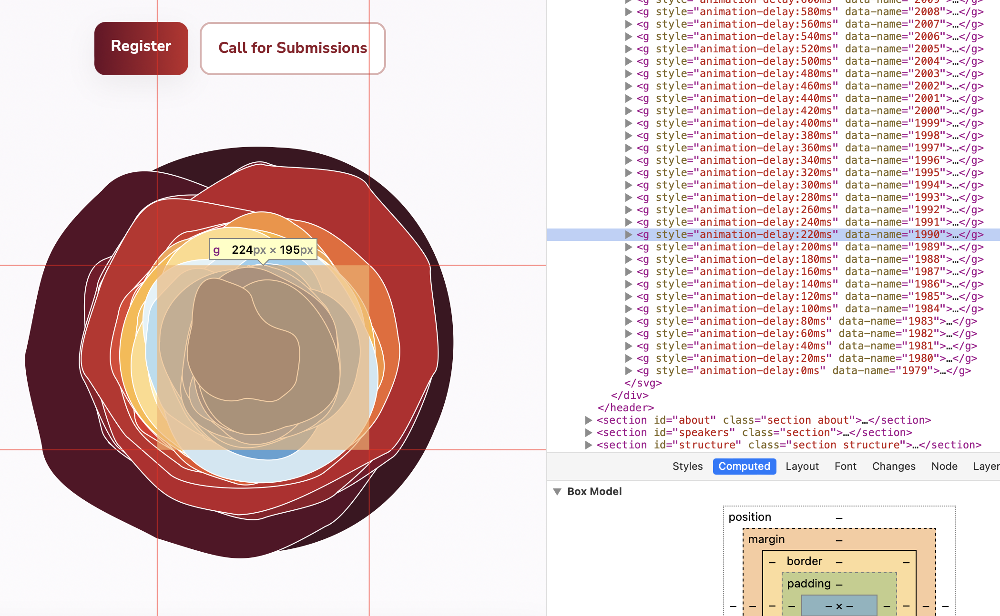

# Reproducing the Visualising Climate Conference Logo
On the 4th to 6th November of 2026 the Visualising Climate 2026 will take place in Bologna, Italy. 
> _Visualising Climate_ is the first global conference on data visualisation for climate and environmental sciences. Bringing together scientists, artists, communicators, and journalists, this event will serve as a meeting point between data and storytelling, evidence and perception, art and science.

I'm working with some of the data provided by the sponsors like [European Centre for Medium-Range Weather Forecasts](https://www.ecmwf.int) (ECMWF) or the [Copernicus Programm](https://www.copernicus.eu/en). I'm far from being an expert but this event really seems like a good idea to me. 

Here I want to recreate their logo. It's really a wonderful piece, especially with the way it's transitioning, giving the impression of a heart beat with the aesthetics of climate slices. The movement totally caught me. The original author of this piece was  [Dr. Anna Lombardi](https://bsky.app/profile/annalombardi.bsky.social).

The way this vis works, should not be to hard to replicate. We need a few things:
- yearly climate data (per month should be enough) 
- a radial layout to map dates to angles
- a _curvy_ function for smooth the outlines, 
- groups for each year 
- and an animation to update the radius changes with a decay. 

The ECMWF account on Bluesky [hinted](https://bsky.app/profile/copernicusecmwf.bsky.social/post/3mibbpqbomk2r) the they used Surface Temperature Anomaly data, provided by ERA5 (a satellite monitoring project by ESA).


## Building the logo basis
In the dev console we can see that the designer chose to use 1979 to 2024 as the data scope.

I'm a bit surprised it looks like way less years because they overlap and I guess many are note really visible or so near to each other I can't distinguish them visually.

The main things I do not often use tbh is the radial scale functions. But the d3 docs got us covered with [radial lines](https://d3js.org/d3-shape/radial-line#radial-lines). We need to define a mapping for `angle` which we map to the date and `radius`, which maps the temperature anomalies. We end up with a couple of scales:

```
...
const minMaxYears = d3.extent(globals.years.map((d) => d[0]));

const x = d3
	.scaleUtc()
	.domain([
		// Centered month on the 15th
		new Date(`${globals.fixed}-01-15`),
		new Date(`${globals.fixed + 1}-01-01`) - 1
	])
	.range([0, 2 * Math.PI]);

// Distance to center for each month
const y = d3.scaleLinear().domain([-1, 1]).range([rInner, rOuter]);

// A helper function to make the line's `angle` function look cleaner
const dateOnRing = (d) => {
	const isoDateMonth = d.day.toISOString().slice(5, 7);
	const isoDateDay = d.day.toISOString().slice(8, 10);
	return x(new Date(`${globals.fixed}-${isoDateMonth}-${isoDateDay}`));
};

// Plug the x and y scales into angle and radius
const l = d3
	.lineRadial()
	// curveCatmullRomClosed should also work
	.curve(d3.curveCardinalClosed.tension(0.1))
	.angle((D) => dateOnRing(D))
	.radius((D) => y(D.temperature_anomaly));

// Map years to colour
const c = d3.scaleSequential(
	[...minMaxYears].reverse(),
	d3.interpolateRdYlBu
);
```

This works pretty well because we can stick to the [radial area chart example](https://observablehq.com/@d3/radial-area-chart/2) example. No need for the area in this example, although **donut polygons** sound fun (noted for later update).

```js
import {ClimateAnomalyRadial} from "./chart.js"
```

```sql id=[...countries]
SELECT distinct(entity) as entity FROM surface_temperatures_anomalies;
```

```sql id=[...world_anomalies]
SELECT entity, code, month, "_2025","_2024","_2023","_2022","_2021","_2020","_2019","_2018","_2017","_2016","_2015","_2014","_2013","_2012","_2011","_2010","_2009","_2008","_2007","_2006","_2005","_2004","_2003","_2002","_2001","_2000","_1999","_1998","_1997","_1996","_1995","_1994","_1993","_1992","_1991","_1990","_1989","_1988","_1987","_1986","_1985","_1984","_1983","_1982","_1981","_1980","_1979" 
FROM surface_temperatures_anomalies WHERE CODE = 'OWID_WRL';
```

```sql id=[...selected_anomalies]
SELECT entity, code, month, "_2025","_2024","_2023","_2022","_2021","_2020","_2019","_2018","_2017","_2016","_2015","_2014","_2013","_2012","_2011","_2010","_2009","_2008","_2007","_2006","_2005","_2004","_2003","_2002","_2001","_2000","_1999","_1998","_1997","_1996","_1995","_1994","_1993","_1992","_1991","_1990","_1989","_1988","_1987","_1986","_1985","_1984","_1983","_1982","_1981","_1980","_1979" 
FROM surface_temperatures_anomalies WHERE entity = ${form.country.entity};
```

<div style="overflow: visible">

Each ring is a year mapped to a circle, a year spans 360°, temperature anomalies per month define the distance to the center. Choose a country of and see how the plates shape up:

```js
const form = view(Inputs.form({
  country: Inputs.select(countries, {label: "Countries", format: d => d.entity, value: countries.find(d => d.entity === "Italy")}),
  compare: Inputs.toggle({label: "Compare to world average", value: false}),
}))
```
</div>

<div class="grid grid-cols-2">
<div style="margin-bottom: 12px;">
<figure style="z-index: 10; width: 100%; display: flex; flex-flow: column; align-items: center;">
<h2 style="min-height: 25px">World average<h2>
${ClimateAnomalyRadial({temperature_anomalies: world_anomalies, width: 800, animate: form.animate})}
</figure>
</div>
<div>
<figure style="z-index: 10; width: 100%; display: flex; flex-flow: column; align-items: center;">
<h2 style="min-height: 25px">${form.country.entity}<h2>
${ClimateAnomalyRadial({temperature_anomalies: selected_anomalies, width: 800, ...form})}
</figure>
</div>
</div>

## Adding animation
The really hard thing for me was to get an animation running. I'm kind of scared to use `setInterval`, I have the irrational feeling the browser might explode because something went wrong 🤷‍♂️.

```
// We need a state to trigger per group transform scales
// small or large version correspond to state true or false
mutable state = false;

// New cell for the playing state
mutable playing = false;

// Another cell for to trigger the Interval as soon as playing is true
{
  let interval;
  const start = () => {
    interval = setInterval(() => {
      // The thing that updates the chart
      // By passing the state we ensure it's called when state changes
      chart.update(data, state);
      mutable state = !state;
    }, 1600);
  };
  // Clean up the interval (call on invalidation)
  const stop = () => clearInterval(interval);

  if (playing) start();
  else stop();

  // Cleanup when cell re-runs
  invalidation.then(stop);
}

// And a button cell to actually set playing true
viewof playPause = {
  const btn = html`<button>${playing ? "Pause" : "Play"}</button>`;
  btn.onclick = () => {
    mutable playing = !playing;
  };
  return btn;
}

// One last cell to call the svg's update function which is
// bound to the state from above
update = chart.update(data, state)
```

Inside the update function we simply build the SVG using the scales we have and look for the state variable in the update function. Each year group is transformed based on the state. Either `scale(1, 1)` for the large version or
`scale(0.9, 0.9)` for the slightly smaller version. The rest is done using durations and easing functions based on the state.

I wanted to do this animation with d3js but that was not the best idea. The original for the _Visualising Climate Conference_ uses css styles and fixed the durations per group individually. It's so much easier to simply set the delays and have a proper animation with css styles. But tbh I need to learn this:

```
@keyframes visclimate-popup {
  0% { scale: 0.5 }

  100% { scale: 1 }
}

@keyframes visclimate-pulse {
  0% { scale: 1 }

  25% { scale: .975 }

  100% { scale: 1 }
}

.visclimate-logo g {
  scale: 0;
  animation: visclimate-popup 1s forwards;
  transform-origin: top left;
  animation-timing-function: cubic-bezier(.27, 1.24, .64, 1);
}

.visclimate-logo path {
  animation: visclimate-pulse 2s infinite;
  transform-origin: center;
  animation-timing-function: cubic-bezier(0.34, 1.56, 0.64, 1);
}

@media (prefers-reduced-motion: reduce) {
  .visclimate-logo g {
    animation: none;
    scale: 1;
  }

  .visclimate-logo path {
    animation: none;
  }
}
```

The rest is done by setting the `animation-delay` for each element. I did that by adding another scale:

```
const a = Object.fromEntries([...years].reverse().map(([year, _], i) => [year, i * 20]));
```

It causes the element to start with an offset of 20ms. For the `animation-timing-function`s I'm not experienced enough to talk about it. I need to learn how css animations are created and how these functions are designed. There are tools I'm sure.

```sql id=[...italy_anomalies]
SELECT entity, code, month, "_2025","_2024","_2023","_2022","_2021","_2020","_2019","_2018","_2017","_2016","_2015","_2014","_2013","_2012","_2011","_2010","_2009","_2008","_2007","_2006","_2005","_2004","_2003","_2002","_2001","_2000","_1999","_1998","_1997","_1996","_1995","_1994","_1993","_1992","_1991","_1990","_1989","_1988","_1987","_1986","_1985","_1984","_1983","_1982","_1981","_1980","_1979"
FROM surface_temperatures_anomalies WHERE entity = 'Italy';
```

<div>
<figure style="z-index: 10; width: 100%; display: flex; flex-flow: column; align-items: center;">
<h2 style="min-height: 25px">Italy</h2>
${ClimateAnomalyRadial({temperature_anomalies: italy_anomalies, width: 800, animate: true})}
</figure>
</div>

## Conclusion
Motion designers are awesome freaks. I love their animation even more since I tried to replicate it and noticed how hard it is to get the impression of a heart beat, or maybe it's simply wrong tooling but still these people do fun stuff :)

Here is the vis code in an [Observable Notebook](https://observablehq.com/d/54b3867e8c5f1551), so you can explore everything on you'r own. Just fork it and play around with it maybe you are a motion affine person :)

