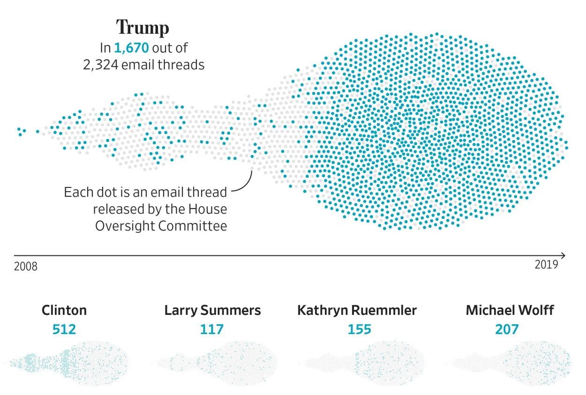

**Content-Warning: No explicit material is show or discussed in detail, but the general context can be mentally challenging.**


# The Epstein Email Cache
An **static visualisation** to show who was mentioned in the Jeffrey Epstein Email data at which time. 

**Disclaimer: Since I'm not a journalist I'm not doing the counting and reading through this horrable content. I got great respect for people that read through all this. I try to find the names programmatically but that's it.**



This is an image shared by [@emptywheel](https://bsky.app/profile/emptywheel.bsky.social) on Bluesky. The original article ["The epstein email cache"](https://www.wsj.com/politics/policy/the-epstein-email-cache-2-300-messages-many-of-which-mention-trump-5edf0226) is locked behind a paywall.

It's a good visual, it informs you and it shows the size of the data released by the White House Council, but it looks like sperm: [_Why ... why is it sperm_](https://bsky.app/profile/hunterub.bsky.social/post/3m5mh6aogwc2u). Not very sensitive to the topic, but that is to expect from social media. 


## Regarding the data
There are a few sources to get or see this email cache. Some I find inappropriate, like jmail that serves the data as a website, but in the aesthetics of being logged into the account of J.Epstein. It just feels like inside a monster - for me personally to much. Anyways the [official US Department of Justice' page](https://www.justice.gov/epstein) and other sites provide data access through a text search, but not a bulk export. 

A Huggingface user published the dataset of email on Huggingface-datasets. Huggingface is a platform for machine learning, LLM trainers and researchers on AI in general. That's a questionable place to to publish this data, but it's handily wrapped in a parquet file, so I downloaded it for the purpose of recreating the WSJ's graphic. Additionally it's not the original data because there was no way for me to see when each entry was released at which time and exclude the documents the White House Council has released after the data of WSJ's article.

## Visualisation

At first I wanted to try a naive approach and simply use what [Observable Plot](https://observablehq.com/@observablehq/plot-dodge-cars) has to offer, although this is most likely not quite what we need here.


```sql id=[...email_threads]
SELECT messages from "email_threads";
```

```js
function checkMentioning(person, thread) {
    const mentioned = thread.map(m => {
        const sender = m.sender ? m.sender.includes(person) : false;
        const recipients = m.recipients ? m.recipients.includes(person) : false;
        const subject = m.subject ? m.subject.includes(person) : false;
        const body = m.body ? m.body.includes(person) : false;
        return sender | recipients | subject | body;
    });
    return { name: person, mentioned: mentioned.reduce((a, b) => a + b) > 0 }
}

const persons = ["Donald Trump", "Hillary Clinton", "Larry Summers", "Kathryn Ruemmler", "Michael Wolff"];

const emails = email_threads.map(
    d => ({ 
        ...d,
        messages: JSON.parse(d.messages).map(m => ({
            ...m,
            original_timestamp: m.timestamp,
            timestamp: new Date(m.timestamp),
        })),
        mentioned: persons.map(p => checkMentioning(p, JSON.parse(d.messages))).filter(d => d.mentioned).map(({ name }) => name)
    })
).map(
    ({ message_count, mentioned, messages }) => ({ message_count, mentioned, timestamp: messages[0].timestamp })
).filter(d => d.timestamp >= new Date(2007, 12, 31));
```


```js
// Naive Observable plot approach:
const beeswarmNaive = () => Plot.plot({
    width: 1000,
    height: 600,
    marks: [
        Plot.dotX(emails, 
            Plot.dodgeX("middle", { 
                y: "timestamp", 
                sort: d => !d.mentioned.includes(person),
                fill: d => d.mentioned.includes(person) ? "#51CFDD" : "#999",
                r: 1.8,
            })
        ),
    ],
});
```

<div class="card full">
${beeswarmNaive()}
</div>

Ok, that didn't work as expected. I even had to use the height to encode the time, because the stacks are so large and only fit the width dimension. No readability at all. So, it looks like the graphics department at WSJ did a little trick to make it look less spiky and smoother. 
Reading through the options on the [Dodge transform](https://observablehq.com/plot/transforms/dodge) I wondered how WSJ did the smoothing thing. And in fact there was some interesting hinting: [force-directed-beeswarm](https://observablehq.com/@harrystevens/force-directed-beeswarm). There are many of these force-directed plots, basically it's a way to guide the functions calculating the locations for data entries along a dimenion into some direction. In this case along the x axis to the middle. By forcing the locations in x and y of the circles to orient more around the middle of the chart the locations in x are lowered in priority. That makes the chart less accuracte but more appealing but moves the graphic more towards the infographics department - it's not accurate enough to count as a real chart. But that's definition stuff. 

You can use it like so:
```
const beeswarm = beeswarmForce()
    .x(d => x(d.timestamp)) // x location is still the timestamp
    .y(height / 2) // force center on y
    .r(4); // uniform size
```

Under the hood this function uses `d3.forceSimulation` with a `force("collide", ...)` which respects the radius dimension so dots are not overlapping. If you want to know more about how this works, read through the `force-directed-beeswarm` example by [Harry Stevens](https://observablehq.com/@harrystevens), he's even using the circle size as an additional encoding level.

## Directed beeswarms are slow

Every location of the 5k email threads is recalculated, based on the width of the graphic. When I resize the browser window this size will change and causes:
- Recalculation of x axis since the max value of x has changed
- Dot position recalculation with `beeswarmForce` since this need the scale that just updated
  - This will in turn run the `d3.forceSimulation` with the n ticks we set in the function for all 5k dots

I haven't found a good solution for this. Since `forceSimulation` is the main time stealer here we have no way to reliably update the visual on resize events. 

A lazy workaround is to simply define two widths one for data one for the visual. The width for visuals is fixed the other one in the width updated by the ResizeObserver. Everything related to the time scale and the force direction function can compute once, the rest is not dependent on this width and just updates svg width or selection updates or everything not dependent on the time axis. This way it's a once computed static svg. 

```js
const person = view(Inputs.select(persons, {label: "Person", value: "Michael Wolff"}));
```

```js
// With direction forcing:
import {beeswarmForce, BeeswarmForcePlot} from "./chart.js"

const height = 450;

// The bottom x scale for timestamps
const x = d3.scaleTime(
    [new Date(2008, 0, 1), d3.max(emails, d => d.timestamp)],
    [0, 800 - 100]
);

// Calculates the force using x, y, r
const beeswarm = beeswarmForce()
    .x(d => x(d.timestamp))
    .y(height / 2) // Try to align the dot centered
    .r(4);

const margin = ({ top: 0, bottom: 12, left: 1, right: 1 });
```

```js
const forced_data = beeswarm(emails);
```

<div id="chart" class="card full">
<figure class="plot">
<h2>Rebuild WSJ Graphic of the Epstein email cache</h2>
<h3>This is just a simple approach without actually reading through these horrible email correspondences.</h3>
${BeeswarmForcePlot({forced_data, x_scale: x, person, width, height, data_width: 800 + 60, margin})}
</figure>
</div>

For static assets this is now an svg, if you'r familiar with [Figma](https://www.figma.com/), you know what to do. Copy the dev console's svg code and paste it in figma. This is create a frame and everything that's not CSS class property will be copied along and you will find it in your Figma pannels.

# Conclusion

What a horrible topic. During data preperation where you can see the mail body, I had a constant feeling of disgust. Really, anyone who doesn't work in journalism must be glad they don't have to face these depths of human depravity. I certainly am now.
